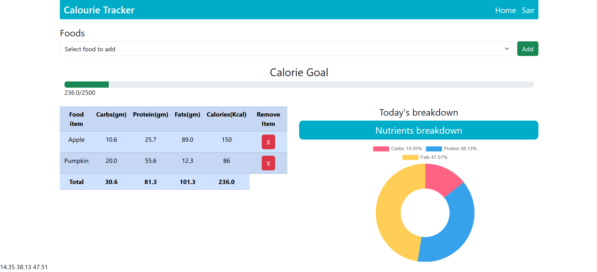

# Calorie Tracker

### About 📙
We eat many times a day, so it is always necessary to check whether what we eat has enough calories to give us energy, and with Calorie Tracker this is possible.
With our calorie tracker, you will have caloric information about the food you consume, also taking into account the amounts of protein, carbohydrates and fat, without forgetting the graphical demonstrations
- Project preview


### Tools 🛠️
- Python
- Django
- HTML/CSS
- Bootstrap
- JavaScript
### How to run?🏃
#### Required
- Python 3.12.1
- Django 5.0.6

### Procedure
```bash
    # In your git bash, clone the repo.
    git clone https://github.com/angelo-francisco/CalourieTracker.git

    # Activate the enviroment
    # att.: can be different on another OS
    ./venv/Scripts/Activate.ps1

    # run the project
    python manage.py runserver
```
### License 🔑

The license of the project is [MIT](https://opensource.org/license/mit)